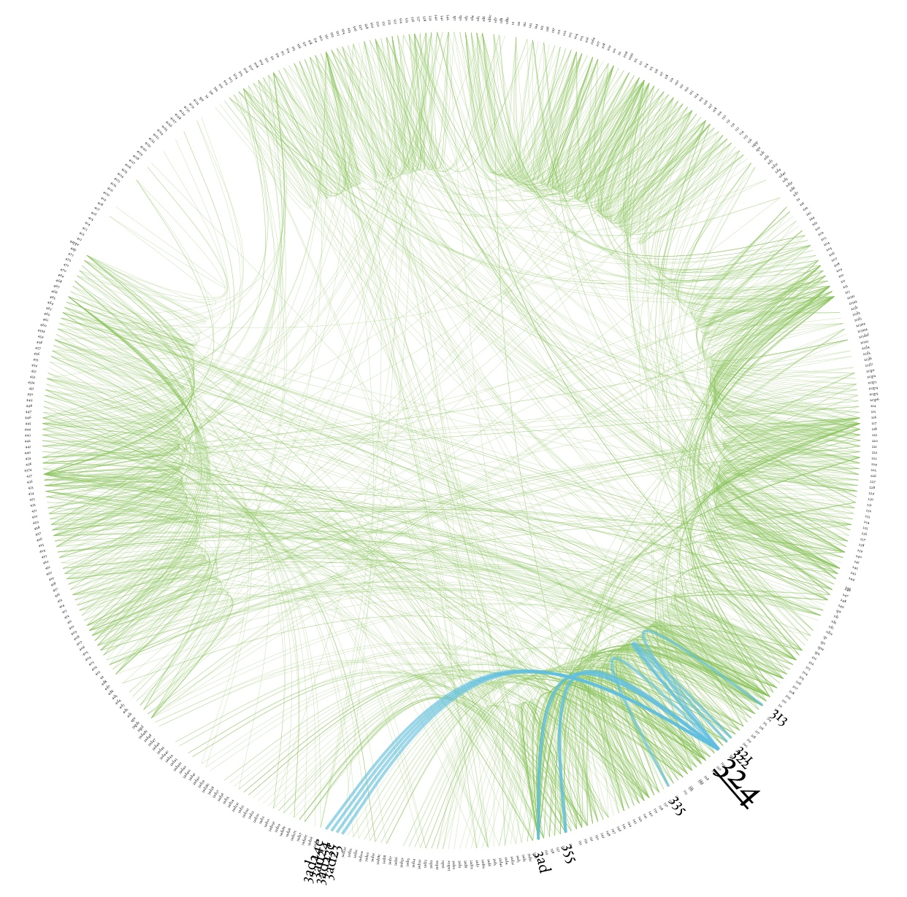
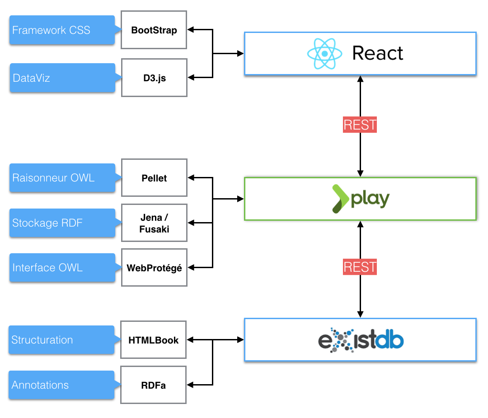

# Dedale.io

Le projet *Dedale.io* vise à bâtir une plateforme open source pour l'étude des systèmes philosophiques basée sur les technologies des données liées (*linked data*).

Un prototype sera bientôt à nouveau en ligne.

## Aperçu des fonctionnalités

### Lecture
- Naviguer efficacement grâce à de la visualisation de données ;
- Intervertir entre une vue "Lecture" et une vue "Ontologie", ou afficher les deux ;
- Afficher une ou plusieurs traductions d'un texte ;
- Générer un livre numérique à partir de différents réglages.

  

*Exemple de visualisation de données (dataviz) entre des propositions, définitions et axiomes de l'Éthique de Spinoza*

### Étude des systèmes
- Représentation visuelle d'un système philosophique ;
- Comparaison de systèmes (par exemple, comparaison de l'interprétation du système spinoziste par Gueroult avec celle de Macherey) ;
- Trouver la définition d'un concept et comprendre ses liens avec des concepts de ce système ou d'un autre ;
- Comprendre l'évolution d'un concept et son usage au sein d'un corpus.

### Collaboration
- Echanger autour d'un système, d'un concept et d'un sujet libre à l'aide d'outils permettant la citation d'entités des systèmes philosophiques présents dans la plateforme ;
- Créer et partager un parcours argumentatif ;
- D'autres applications peuvent récupérer des données depuis la plateforme en utilisant une API JSON et un endpoint SPARQL.

## Stack

### Front-end

* React
* D3.js
* Redux (predictable state container) 
* ImmutableJS

### Back-end

* Play Framework (Scala)
* Exist-Db
* Apache Fusaki

  

# Déploiement du prototype

## Installation
Installer Activator, Exist-DB, bower et npm puis :
* `bower install`
* `npm install`

## Lancement
* Compiler CSS: `gulp watch`
* Exist-Db: `/opt/exist/bin/startup.sh`
* Play Application: `/opt/activator/activator run` (in app root directory)

## Licence

GNU GENERAL PUBLIC LICENSE

